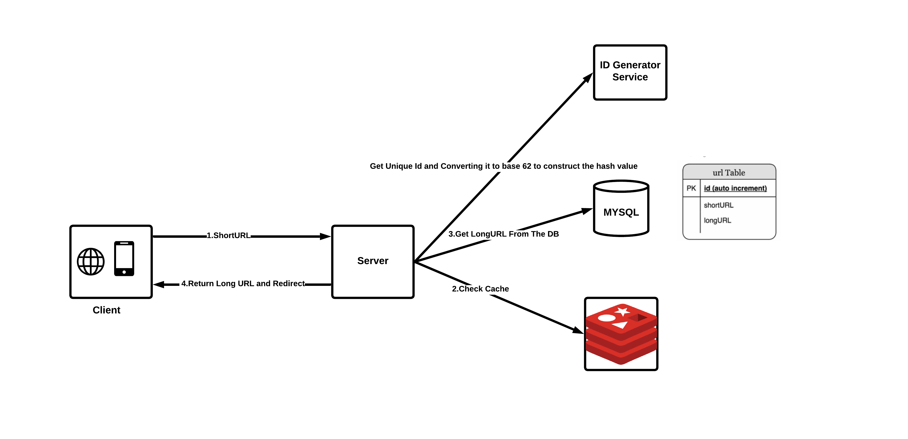

# **URL Shortener Service**

This project is an MVP (Minimum Viable Product) for a **URL Shortener Service** built using **Spring Boot**, **Redis**, and **JPA**. The service allows users to shorten long URLs, track the number of visits to each short URL, and redirect users to the original URL when they access the short URL.

## **Table of Contents**

- [Project Overview](#project-overview)
- [Features](#features)
- [System Design](#system-design)
- [Assumptions and Design Decisions](#assumptions-and-design-decisions)
- [Technology Stack](#technology-stack)
- [Future Enhancements](#future-enhancements)

## **Project Overview**

The URL Shortener service provides a way for users to shorten long URLs, making them easier to share or remember. The service implements key features like URL shortening, redirection, and caching for improved performance.

This system supports:
- **Unique URL Shortening:** Converts long URLs into unique, short URL strings.
- **Redirection:** When a short URL is accessed, the system redirects the user to the original long URL.
- **Cache Optimization:** Redis is used to cache URL mappings for faster retrieval.

## **Features**

1. **Shorten Long URLs:** The service accepts a long URL and returns a unique short URL.
2. **Redirection:** The system performs an HTTP redirection when a short URL is accessed, sending the user to the original long URL.
3. **Custom Short URLs:** Users can customize their short URLs for easy sharing.
4. **URL Visit Tracking:** The system tracks how many times each short URL has been accessed (this can be extended in future versions).

## **System Design**

### **High Level Design** ###

### **Core Components**
1. **User Input (Frontend)**: Users provide a long URL to be shortened.
2. **Backend (Spring Boot Service)**: The service accepts the long URL and generates a unique short URL.
3. **Redis Cache**: Used to cache the mappings for faster lookups.
4. **Database**: Stores the mapping of short URLs to long URLs.
5. **Redirect Logic**: Once a short URL is accessed, the backend retrieves the long URL from either the cache or the database and redirects the user.

### **Flow of Operations**
1. User enters a long URL.
2. System generates a unique short URL and stores both the long and short URL in the database.
3. The system caches the short URL to long URL mapping in Redis.
4. When the short URL is accessed, the system checks the cache first; if not found, it queries the database.
5. Upon successful lookup, the system redirects the user to the original long URL.

## **Assumptions and Design Decisions**

- **Unique Short URLs:** We use a base62 encoding system to generate short URLs from long URLs. The short URL is unique, ensuring no two long URLs are mapped to the same short URL.
- **Cache Expiration:** TTL (Time-to-Live) was not used for caching as URLs are meant to persist indefinitely. Instead, Redis eviction policies like **LRU (Least Recently Used)** are relied upon to manage memory when cache size exceeds limits.
- **URL Customization:** Users are allowed to customize their short URLs, providing a more user-friendly experience.
- **No Authentication:** The service doesn't require user authentication. It's designed to handle anonymous requests for simplicity and ease of use.
- **Database:** The system uses a simple relational database (MYSQL) to store mappings of short URLs to long URLs.

## **Technology Stack**

- **Backend Framework:** Spring Boot (Java)
- **Database:** MySQL (for URL mapping storage)
- **Cache System:** Redis (for caching URL mappings)
- **URL Encoding:** Base62 (for generating short URLs)
- **Development Tools:** Maven, IntelliJ IDEA/VS Code
- **Version Control:** GitHub (for source code management)

## **Future Enhancements** ##
- **Analytics:** Track the number of times a short URL has been clicked.
- **Custom Domains:** Allow users to configure their own domains for shortened URLs.
- **Rate Limiting:** Prevent abuse by limiting the number of URLs a user can shorten within a period.

